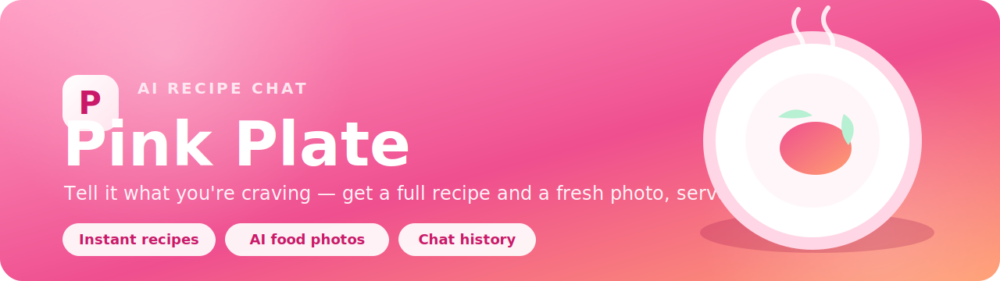
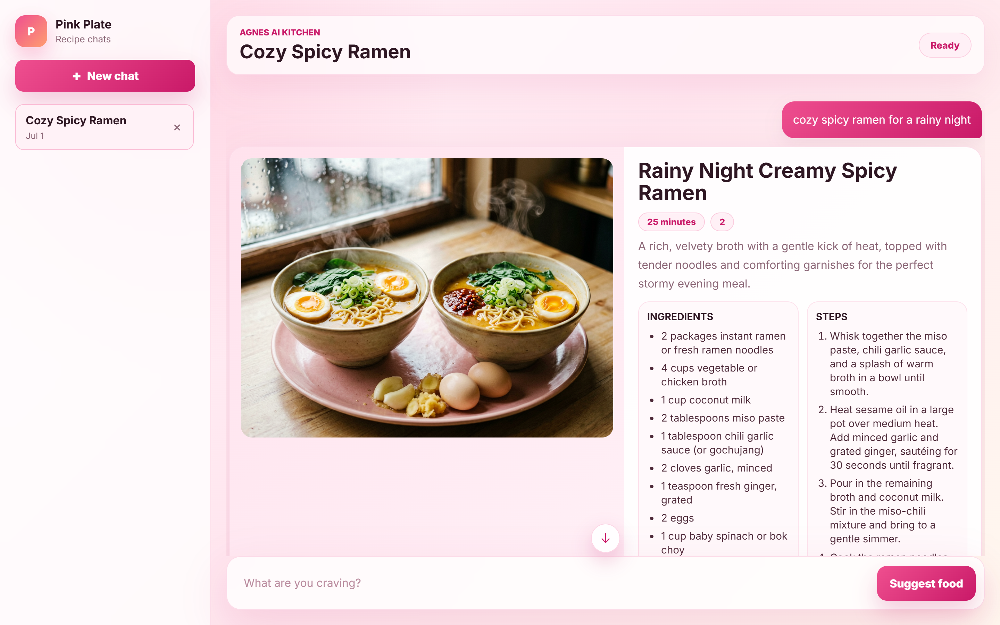
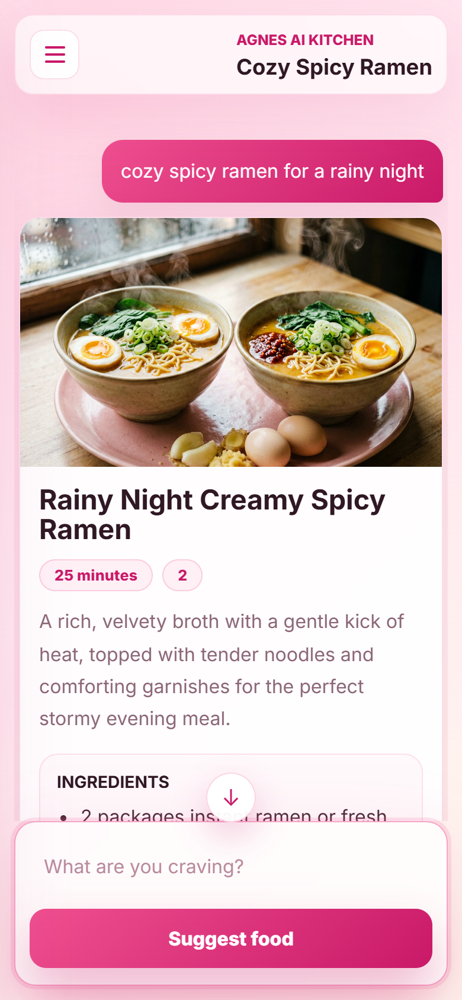

<p align="center">
  
</p>

<h1 align="center">🍽️ Pink Plate</h1>

<p align="center">
  A cheerful, pink-themed recipe chatbot. Tell it what you're craving and it cooks up a
  complete recipe <em>and</em> a fresh AI food photo — all in a fast, mobile-friendly chat UI.
</p>

<p align="center">
  
  
  
  
</p>

<p align="center">
  <a href="https://vercel.com/new/clone?repository-url=https%3A%2F%2Fgithub.com%2Fhammadshakeelai%2Ffood-suggestor&env=AGNES_API_KEY&envDescription=Your%20Agnes%20AI%20API%20key&project-name=pink-plate&repository-name=food-suggestor">
    
  </a>
  &nbsp;
  <a href="https://food-suggestor.vercel.app">
    
  </a>
</p>

<p align="center">
  <strong>🔗 Live:</strong> <a href="https://food-suggestor.vercel.app">food-suggestor.vercel.app</a> &nbsp;·&nbsp;
  <strong>💻 Repo:</strong> <a href="https://github.com/hammadshakeelai/food-suggestor">github.com/hammadshakeelai/food-suggestor</a>
</p>

---

## ✨ Features

- **Conversational recipes** — chat naturally ("something spicy with chicken", "make it vegan") and Pink Plate revises the recipe with full context.
- **AI food photography** — every recipe comes with a generated dish photo, with a graceful fallback if the image model is slow or unavailable.
- **Multiple chats** — recipes are organized into chat tabs, saved in your browser (`localStorage`) so they survive refreshes.
- **Genuinely mobile-first** — off-canvas drawer with tap-to-close backdrop, notch/safe-area aware padding, large touch targets, and a hero photo that reads great on a phone.
- **Thoughtful UX** — Enter-to-send, sticky scroll that follows new messages, a jump-to-latest button, keyboard focus rings, and reduced-motion support.
- **Zero runtime dependencies** — a small vanilla Node HTTP server for local dev and a single Vercel serverless function for production.

## 🖼️ Preview

<p align="center">
  
</p>

<p align="center">
  
</p>

## 🧑‍🍳 Tech Stack

| Layer      | What it uses                                                        |
| ---------- | ------------------------------------------------------------------- |
| Frontend   | Vanilla HTML, CSS (grid + `:has()`), and ES-module JavaScript       |
| Local API  | Node's built-in `http` server (`server.js`) — no framework          |
| Production | Static `public/` + a Vercel serverless function (`api/suggest.js`)  |
| AI         | [Agnes AI](https://apihub.agnes-ai.com) — text + image generation   |

## 🚀 Run it locally

**Prerequisites:** Node.js ≥ 20.

1. Copy the env template and add your Agnes API key:

   ```bash
   cp .env.example .env
   ```

   ```env
   AGNES_API_KEY=your_agnes_api_key_here
   ```

2. Start the server:

   ```bash
   npm start
   ```

3. Open **http://localhost:3001**.

> Your real key lives only in `.env`, which is git-ignored. `.env.example` is a safe template.

## ☁️ Deploy to Vercel

The repo is Vercel-ready: `vercel.json` serves `public/` as static files and runs
`api/suggest.js` as the serverless API.

**One-click (recommended):**

1. Click **[Deploy with Vercel](https://vercel.com/new/clone?repository-url=https%3A%2F%2Fgithub.com%2Fhammadshakeelai%2Ffood-suggestor&env=AGNES_API_KEY&envDescription=Your%20Agnes%20AI%20API%20key&project-name=pink-plate&repository-name=food-suggestor)**.
2. When Vercel prompts for the **`AGNES_API_KEY`** environment variable, paste your Agnes AI key
   (it's the value in your local `.env` file — never committed to git).
3. Deploy. Your app goes live at `https://<project>.vercel.app`.

**From the CLI:**

```bash
npm i -g vercel
vercel login
vercel env add AGNES_API_KEY   # paste your key (Production)
vercel --prod                  # ship it
```

> 🔒 `AGNES_API_KEY` is a **secret** — it lives only in Vercel's Environment Variables
> and your local `.env`. It is never committed to the repository.

## ⚙️ Configuration

All configuration is via environment variables (see `.env.example`):

| Variable            | Default                                | Description                     |
| ------------------- | -------------------------------------- | ------------------------------- |
| `AGNES_API_KEY`     | _(required)_                           | Your Agnes AI key               |
| `PORT`              | `3001`                                 | Local dev port                  |
| `AGNES_BASE_URL`    | `https://apihub.agnes-ai.com/v1`       | API base URL                    |
| `AGNES_TEXT_MODEL`  | `agnes-2.0-flash`                      | Recipe (text) model             |
| `AGNES_IMAGE_MODEL` | `agnes-image-2.1-flash`                | Dish photo (image) model        |

## 📁 Project structure

```
food-suggestor/
├── api/
│   └── suggest.js      # Vercel serverless function (production API)
├── assets/
│   └── banner.svg      # README banner
├── public/
│   ├── index.html      # App shell
│   ├── styles.css      # Pink theme + responsive/mobile layout
│   └── app.js          # Chat state, rendering, drawer, scrolling
├── server.js           # Local dev HTTP server (static + /api/suggest)
├── vercel.json         # Vercel static + function config
└── .env.example        # Environment template
```

## 📄 License

MIT — do what you like, a credit is appreciated. 💗
